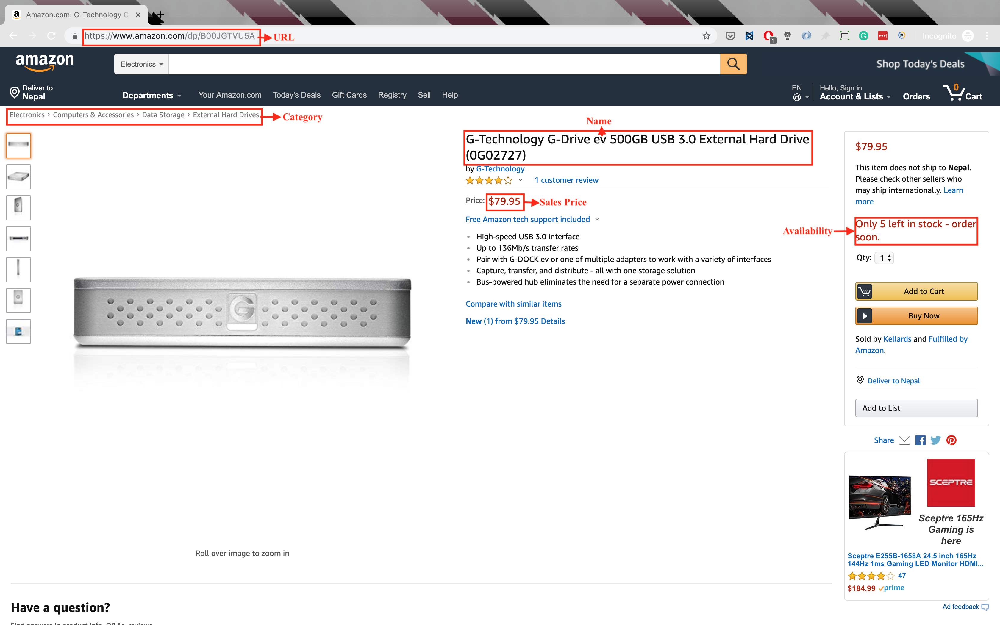

# AmazonScraperv1

> We will build an amazon scraper for extracting product details and pricing. We will build this simple web scraper using python and LXML and run it in a console.

## Usage

#### What can you use an Amazon Scraper for ?

1. **Scrape Product Details that you can’t get with the Product Advertising API**

   Amazon provides a Product Advertising API, but like most other “API”s, this API doesn’t provide all the information that Amazon has on a product page.A scraper can help you extract all the details displayed on the product page.

2. **Monitor products for change in Price, Stock Count/Availability, Rating, etc.**

   By using a web scraper, you can update your data feeds on a timely basis to monitor any product changes. These data feeds can help you form pricing strategies by looking your competition – other sellers or brands.

3. **Analyze how a particular Brand sells on Amazon**

   If you’re a retailer, you can monitor your competitor’s products and see how well they do in the market and make adjustments to reprice and sell your products. You could also use it to _monitor your distribution channel_ to identify how your products are sold on Amazon by sellers, and if it is causing you any harm.

4. **Find Customer Opinions from Amazon Product Reviews**

   Reviews offer abundant amounts of information. If you’re targeting an established set of sellers who have been selling reasonable volumes, you can extract the reviews of their products to find what you should avoid and what you could quickly improve on while trying to sell similar products on Amazon.

Or anything else – the possibilities are endless and only bound by your imagination

## What data are we extracting rom Amazon?



1. Product Name
2. Category
3. Sale Price
4. Avaiability
5. URL

## Process

- We'll build a scraper in Python that can go to any Amazon product page using an ASIN - a unique ID Amazon uses to keep track of products in its database.
- First gather the ASIN
- Next step is to build a script that goes to each one of those product pages, dowloads its HTML, and extracts the fields you need.
- Once, we extract the information, we'll save it into a JSON file for now.

## What tools do wo need?

- Python 3 [available here](https://www.python.org/downloads/)
- Python PIP to install python packages [available here](https://pip.pypa.io/en/stable/installing/)
- Python PIPENV Python package download manager [available here](https://github.com/pypa/pipenv#installation)
- Python Requests send HTTP requests [available here](https://2.python-requests.org//en/master/user/install/)
- Python LXML [available here](http://lxml.de/installation.html)

## Setup

- First setup the virtual env

```python
pipenv --python python 3
```

- Install packages

```python
pipenv install requests lxml
```

## Run

```python
pipenv shell
python amazon_product.py
```

## What to do if you run into captchas ( Blocked ) while scraping?

1. Use proxies and rotate them
2. Specify the User Agents of latest browsers and rotate them
3. Reduce the number of ASINs you scrape per minute
4. Retry, Retry, Retry

## Solution Offered

1. Proxy Rotation
2. User Agents Rotation
